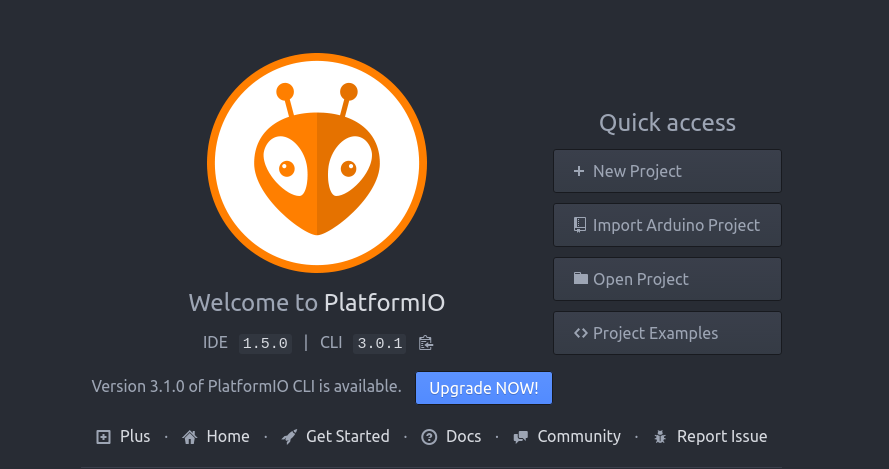
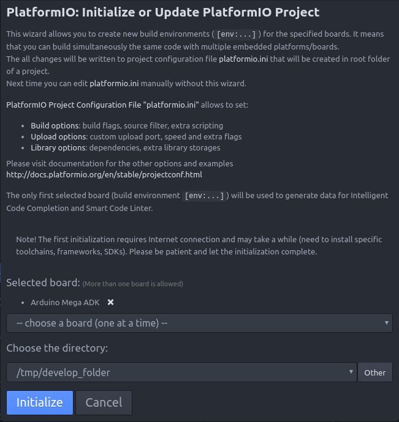
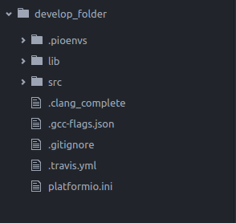
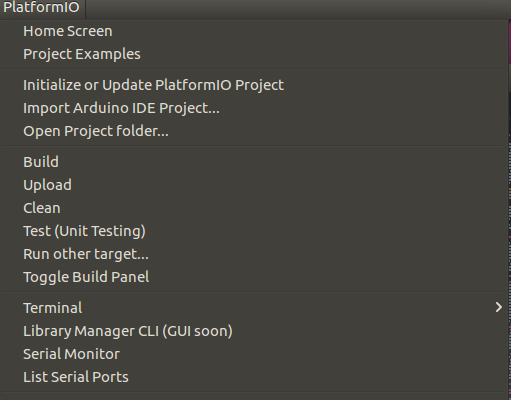

# Wave Water Works Oscillo Drive Test Unit

This repository hosts source code of the software programs used in Wave Water Works Oscillo Drive Test Unit as part of 2016 Fall Semester Senior Design Course at Oakland University. Target of this project is to test the durability of Oscillo Drive. The test unit is capable of controlling frequency and amplitude of input signal, and collect motor RPM, input & output RPM of Oscillo Drive, generator RPM, generated voltage, generated current, and generated power. For robustness, collected data is saved in two distict location.

- **Relase Version:** v1.5
- **Authers:** Oakland Univeristy 2016 Fall Senior Design Group 9 and 10
- **License:** Proprietary to Wave Water Works

|   Program         |  Platform         |   Programming Language |  Folder   |
|:-----------------:|:-----------------:|:----------------------:|:---------:|
| Test Unit Control | Arduino Mega      |        C               |     c     |
| User Interface    | Computer (Windows)|       Java             |    java   |

## Features

- Easy Graphical User Interface to Connect and Control Microcontroller
- Accurate Motor Control utilizing PID feedback controller
- Collects Motor RPM, Input RPM, Output RPM, Voltage, Current, and Power
- User Defined Sampling Rate between 100 ms to 60 seconds
- Backup Data Saved on On-Board SD Card with Post-Process Script

## How-to Guide

### How to Conduct Experiment
1. Connect USB cable from Test Unit to the computer
2. Power on Test Unit power
3. Open graphical user interface on computer
4. Search for Arduino COM port and connect
5. Select frequency of input
6. Select amplitude of input
7. Select sampling rate of measurements
8. Click "Start" to begin experiment
9. Once experiment is completed, click "Stop"

### How to View Collected data
##### Data 1
First copy of measurements data is saved on same folder where graphical user interface is located. The file is in Microsoft Excel format. User can opne the file and start analyzing the data. This is primary source of data.

##### Data 2
Backup copy of measurements data is saved on SD card attached to Arduino Mega. Please take SD card, and attach to Windows computer. There will be Microsoft Excel file included in SD card, which will guide through how to perform post-processing of data. Please periodically delete the test results.

## Setup Instruction

#### Arduino Mega Software Development Environment

The development of Arduino Mesga software code is done using ```Atom``` Editor and ```Platform IO```. The reason of using these tools instead of default Arduino IDE is listed below.

- Easy to manage multiple source files and header files
- Take advantage of auto-completion
- Able to utilize useful Atom plugins for development

The following section walk you through how to create development environment.

1. Go to [Platform IO Website](http://platformio.org/platformio-ide) and click ```Download``` button
2. Select Operating System (OS)
3. Follow the instruction of website to install

Next, Set up environment to use Arduino Mesga ADK

1. Go to ```Platform IO Home``` shown below, and select ```New Project```

  

2. Select ```Arduino Mega ADK``` as ```platform``` and choose development folder

  

3. New folder structure will be created and you are ready to develop

  


#### Desktop Software Development Environment

Computer (java) setup goes here

## How to Compile from Source

#### Arduino Mega Code

1. Clone ```sd_www_odtu``` repository into local folder.
2. Open Atom with Platform IO
3. Open ```Platform IO Home``` and select ```Open Project```
4. Select ```c``` folder inside repository.
5. Go to ```PlatformIO``` -> ```Build```
6. Go to ```PlatformIO``` -> ```Upload```
7. Arduino is ready to be used

For the reference ```PlatformIO``` option looks like following



#### Java Code

Compile and package instruction goes here

## Troubleshooting
